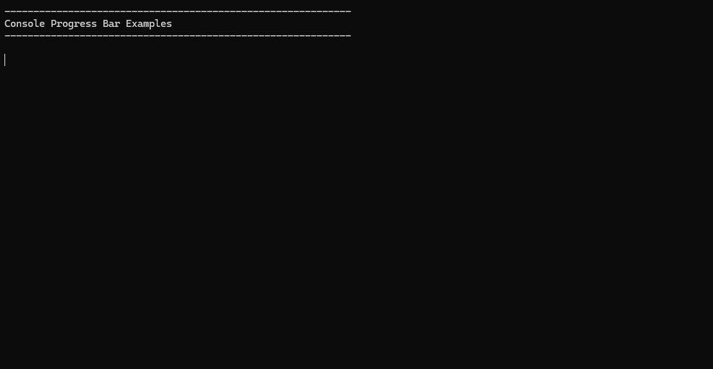

# Console Progress Bar

This project provides functions to easily and conveniently display a progress bar in the console in C# when iterating over an enumeration. (similar to `tqdm` in python)
[https://github.com/tqdm/tqdm]('sdf')

This is a private project for fun and learning purposes. It is not intended to be used in production code.

```csharp
using ConsoleProgressBar;

int[] numbers = [1, 2, 3, 4, 5, 6, 7, 8, 9, 10];

foreach (int number in numbers.ConsoleProgress())
{
	// Do something with the number
}
```

## Styling

There are different predefined styles and color sets that can be used to change the appearance of the progress bar. All default styles can be accessed through the `ConsoleProgressStyle` class.

```csharp
foreach (int number in numbers
	.ConsoleProgress()
	.WithStyle(ConsoleProgressStyle.Millennium) )
{
	// Do something with the number
}
```



Of course it is possible to define own custom styles using the `ConsoleProgressStyle` class.

```csharp
var customStyle = new ConsoleProgressStyle(true, true, ">>", "<<", '*', '#', FractionsSets.AnimationCircle),

foreach (int number in numbers
	.ConsoleProgress()
	.WithStyle(customStyle) )
{
	// Do something with the number
}
```


## Colors

You can apply different color sets to the progress bar using the `.WithColors(…)`. All default color sets can be accessed through the `ConsoleProgressColors` class.

```csharp
foreach (int number in numbers
	.ConsoleProgress()
	.WithColors(ConsoleProgressColors.Red) )
{
	// your code here
}
```


Colors can also be customized by the `.WithColor(…)` and `.WithBgColor(…)` extension methods.

```csharp
foreach (int number in numbers
	.ConsoleProgress()
	.WithColor(ConsoleColor.Blue, ConsoleColor.Cyan, ConsoleColor.DarkGray)
	.WithBgColor(ConsoleColor.Red) )
{
	// your code here
}
```

## Random Examples

On the last page of the example console application `ConsoleExample` there are some examples of random combinations of the available styles and colors for the progress bar.


## Additional Features

When iterating over huge external data (e.g. entity framework table rows) it might be useful to provide the progress bar with the total number of elements to be processed. This can be done by providing the total number of elements with `.WithPreCount(…)` extension method.

For debugging it might be useful to cancel the iteration after a certain number of elements. This can be done by providing the maximum number of elements with `.CancelAfter(…)` extension method.

For testing purposes, there is the extension method `.WithDebugMode()` which will prevent the progress par from trying to read the window size and cursor positions which might not work in the testing environment.